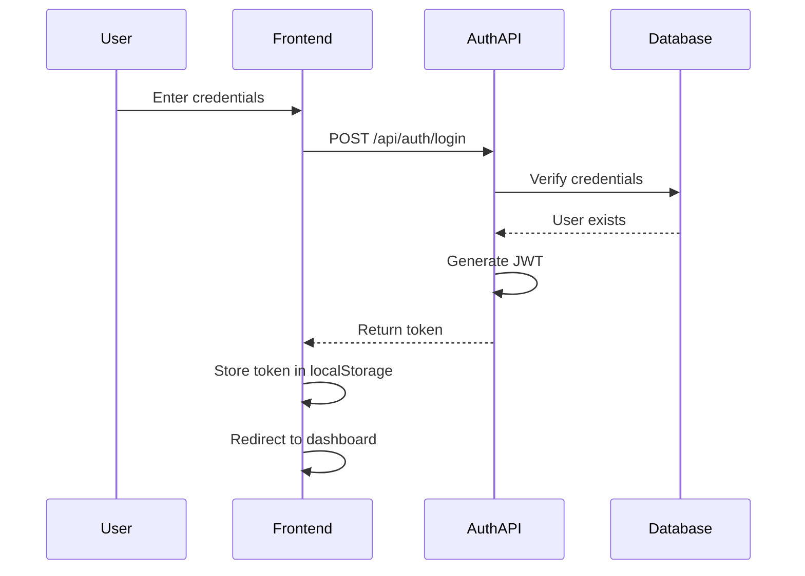
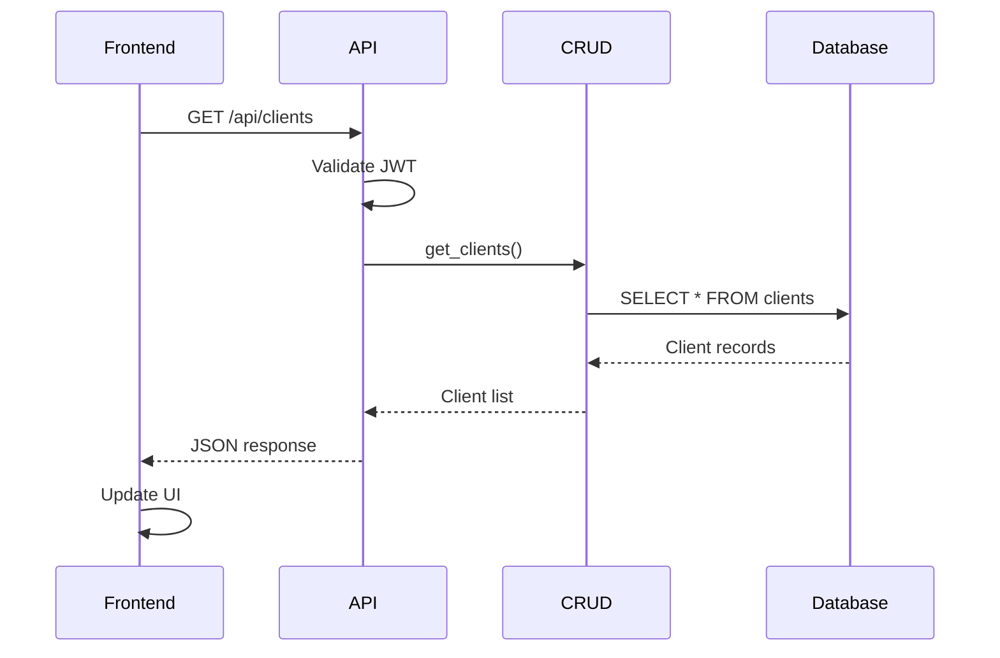
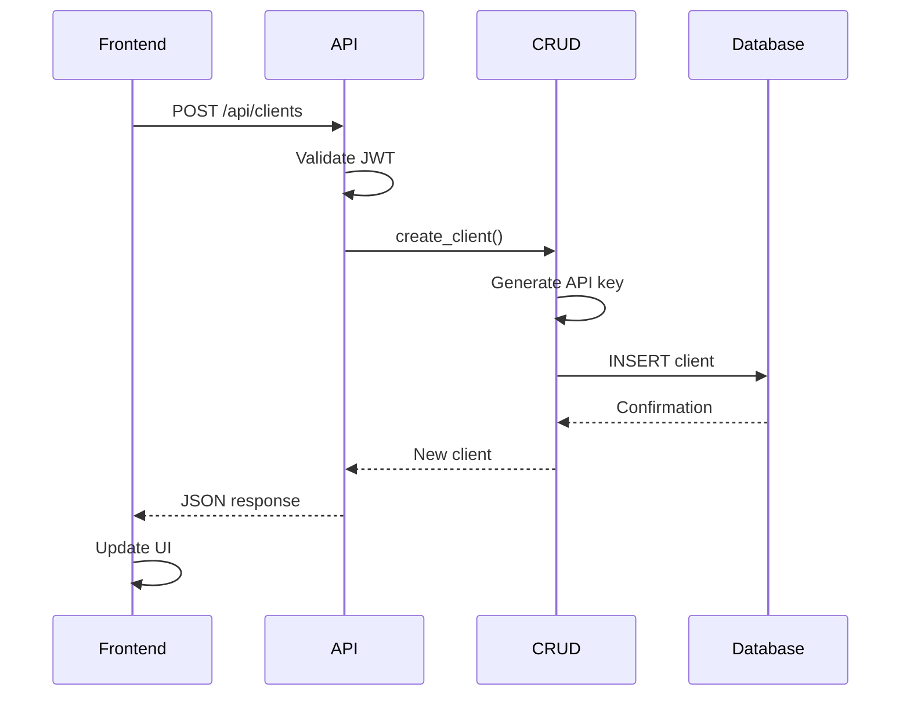
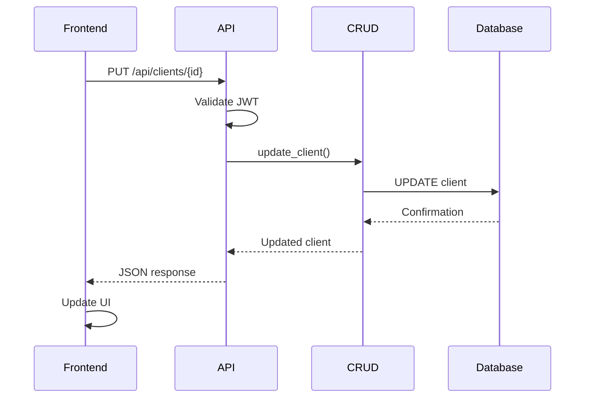

# API Intent Recognition System - Data Flow Documentation

## System Architecture

### 1. Directory Structure
```
api_admin/
├── app/
│   ├── api/           # API endpoints
│   ├── core/          # Core functionality
│   ├── crud/          # Database operations
│   ├── models/        # SQLAlchemy models
│   ├── schemas/       # Pydantic schemas
│   └── database/      # Database configuration
├── templates/         # HTML templates
└── main.py           # Application entry point
```

### 2. Key Components

#### Frontend Components
- `login.html`: User authentication interface
- `dashboard.html`: Main application dashboard
- `clients.html`: Client management interface

#### Backend Components
- `main.py`: FastAPI application setup
- `api/*.py`: API route handlers
- `crud/*.py`: Database operations
- `models/*.py`: Database models
- `schemas/*.py`: Data validation schemas
- `core/*.py`: Core functionality (auth, config)

## Data Flow Processes

### 1. Authentication Flow



**Code Flow:**
1. User submits login form (`login.html`):
```javascript
form.addEventListener('submit', async (e) => {
    e.preventDefault();
    const response = await fetch('/api/auth/login', {
        method: 'POST',
        body: new FormData(form)
    });
    if (response.ok) {
        const data = await response.json();
        localStorage.setItem('token', data.access_token);
        window.location.href = '/dashboard';
    }
});
```

2. Backend processes login (`auth.py`):
```python
@router.post("/api/auth/login")
async def login(form_data: OAuth2PasswordRequestForm):
    user = authenticate_user(form_data.username, form_data.password)
    if not user:
        raise HTTPException(status_code=401)
    token = create_access_token(user.id)
    return {"access_token": token}
```

### 2. Client Management Flow

#### 2.1 List Clients


**Code Flow:**
```javascript
// clients.html
async function loadClients() {
    const response = await fetch('/api/clients', {
        headers: {
            'Authorization': `Bearer ${token}`
        }
    });
    const clients = await response.json();
    displayClients(clients);
}
```

```python
# api/clients.py
@router.get("/api/clients")
async def get_clients(session: AsyncSession, current_user: User):
    return await crud_client.get_clients(session)

# crud/crud_client.py
async def get_clients(session: AsyncSession) -> List[Client]:
    result = await session.execute(select(Client))
    return result.scalars().all()
```

#### 2.2 Create Client


**Code Flow:**
```javascript
// clients.html
clientForm.addEventListener('submit', async (e) => {
    e.preventDefault();
    const response = await fetch('/api/clients', {
        method: 'POST',
        headers: {
            'Authorization': `Bearer ${token}`,
            'Content-Type': 'application/json'
        },
        body: JSON.stringify({
            name: clientName.value
        })
    });
    if (response.ok) {
        loadClients();
    }
});
```

```python
# crud/crud_client.py
async def create_client(session: AsyncSession, name: str) -> Client:
    client = Client(
        id=str(uuid.uuid4()),
        name=name,
        api_key=str(uuid.uuid4())
    )
    session.add(client)
    await session.commit()
    return client
```

#### 2.3 Update Client


**Code Flow:**
```javascript
// clients.html
async function editClient(id, name, active) {
    const response = await fetch(`/api/clients/${id}`, {
        method: 'PUT',
        headers: {
            'Authorization': `Bearer ${token}`,
            'Content-Type': 'application/json'
        },
        body: JSON.stringify({
            name: name,
            active: active
        })
    });
    if (response.ok) {
        loadClients();
    }
}
```

```python
# crud/crud_client.py
async def update_client(session: AsyncSession, client_id: str, name: str, active: int) -> Optional[Client]:
    client = await get_client(session, client_id)
    if client:
        client.name = name
        client.active = active
        await session.commit()
    return client
```

### 3. Security Implementation

#### 3.1 JWT Token Flow
```python
# core/security.py
def create_access_token(user_id: str) -> str:
    payload = {
        "sub": user_id,
        "exp": datetime.utcnow() + timedelta(minutes=ACCESS_TOKEN_EXPIRE_MINUTES)
    }
    return jwt.encode(payload, SECRET_KEY, algorithm=ALGORITHM)

# core/auth.py
async def get_current_user(token: str = Depends(oauth2_scheme)) -> User:
    try:
        payload = jwt.decode(token, SECRET_KEY, algorithms=[ALGORITHM])
        user_id = payload.get("sub")
        if user_id is None:
            raise credentials_exception
        return await get_user(user_id)
    except JWTError:
        raise credentials_exception
```

### 4. Database Schema

```sql
-- Client Table
CREATE TABLE clients (
    id TEXT PRIMARY KEY,
    name TEXT NOT NULL,
    api_key TEXT UNIQUE NOT NULL,
    active INTEGER DEFAULT 1,
    description TEXT,
    created_at TIMESTAMP DEFAULT CURRENT_TIMESTAMP
);

-- User Table
CREATE TABLE users (
    id TEXT PRIMARY KEY,
    username TEXT UNIQUE NOT NULL,
    hashed_password TEXT NOT NULL,
    is_active INTEGER DEFAULT 1
);
```

## Best Practices Implemented

1. **Security**:
   - Password hashing with bcrypt
   - JWT token authentication
   - SQL injection prevention with SQLAlchemy
   - XSS prevention with proper HTML escaping

2. **Performance**:
   - Async database operations
   - Connection pooling
   - Efficient query patterns

3. **Code Organization**:
   - Clear separation of concerns
   - Modular architecture
   - Type hints for better maintainability

4. **Error Handling**:
   - Comprehensive error messages
   - Proper HTTP status codes
   - Client-side error handling
   - Server-side logging

## Common Operations

1. **Adding a New API Endpoint**:
```python
@router.post("/api/new-endpoint")
async def new_endpoint(
    data: SchemaModel,
    session: AsyncSession = Depends(get_async_session),
    current_user: User = Depends(get_current_user)
):
    # Implementation
    pass
```

2. **Adding a New Database Model**:
```python
class NewModel(Base):
    __tablename__ = "new_table"
    
    id = Column(String, primary_key=True, default=lambda: str(uuid.uuid4()))
    created_at = Column(DateTime, default=datetime.utcnow)
```

3. **Adding a New Frontend Feature**:
```javascript
async function newFeature() {
    try {
        const response = await fetch('/api/endpoint', {
            headers: {
                'Authorization': `Bearer ${localStorage.getItem('token')}`
            }
        });
        // Handle response
    } catch (error) {
        console.error('Error:', error);
    }
}
```
